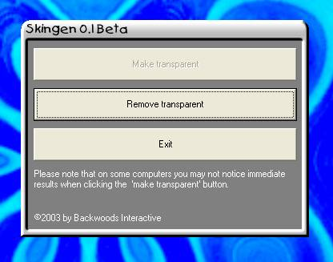

## New\! Skingen\! Make transparent forms the right way\!

### Description

Skingen loads a bitmap and makes a form transparent. See screenshot.
 
### More Info
 
You may freely distribute this.

Please however include credits to Backwoods

Interactive for the 'Skingen Engine'.

This engine is free for non-commercial and

commercial use however you may not charge

for the Skingen source code.

             |
---                |---
**Submitted On**   |2003-10-18 16:34:58
**By**             |[Jimmy Kelly](https://github.com/Planet-Source-Code/PSCIndex/blob/master/ByAuthor/jimmy-kelly.md)
**Level**          |Intermediate
**User Rating**    |5.0 (10 globes from 2 users)
**Compatibility**  |VB 6\.0
**Category**       |[Custom Controls/ Forms/  Menus](https://github.com/Planet-Source-Code/PSCIndex/blob/master/ByCategory/custom-controls-forms-menus__1-4.md)
**World**          |[Visual Basic](https://github.com/Planet-Source-Code/PSCIndex/blob/master/ByWorld/visual-basic.md)
**Archive File**   |[New\!\_Sking16605710182003\.zip](https://github.com/Planet-Source-Code/jimmy-kelly-new-skingen-make-transparent-forms-the-right-way__1-49330/archive/master.zip)

